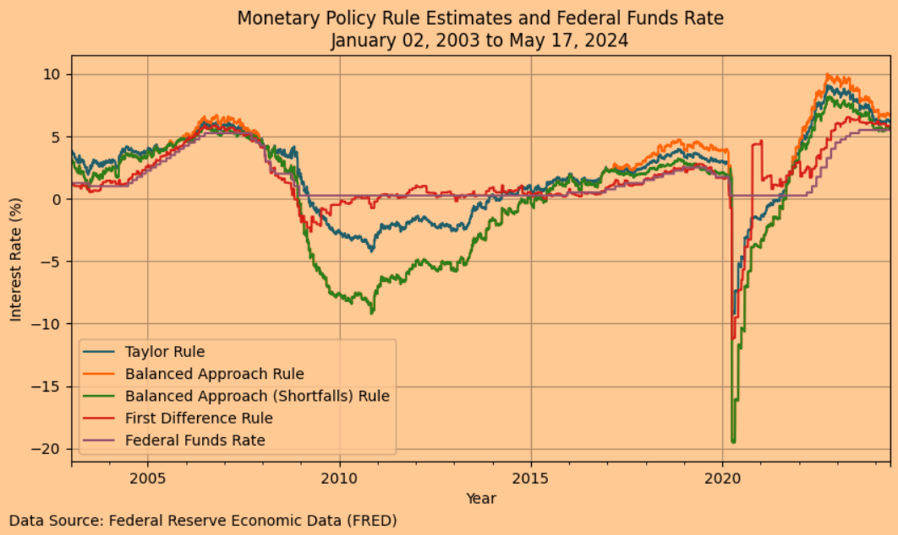
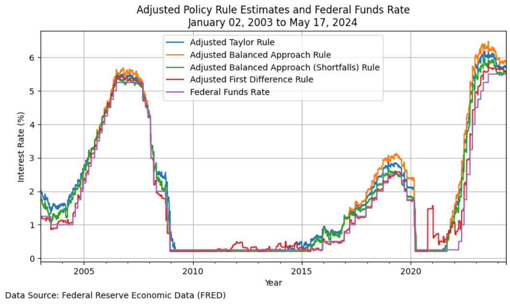

<p style="text-align: center;">
    
</p>

# PyEconomics

**PyEconomics** is a Python library for economic and financial analysis,
designed to provide tools and models for analyzing various aspects of economic,
financial, and fiscal policy. Whether you're a developer, economist, financial
analyst, or researcher, PyEconomics aims to be your go-to resource for
sophisticated economic modeling and analysis.

| Category            | Badge                                                                                                                                                                                                                                                                                                                                                                                                        |
|---------------------|--------------------------------------------------------------------------------------------------------------------------------------------------------------------------------------------------------------------------------------------------------------------------------------------------------------------------------------------------------------------------------------------------------------|
| **Testing**         | [](https://github.com/nathanramoscfa/pyeconomics/actions/workflows/tests.yml) [](https://codecov.io/gh/nathanramoscfa/pyeconomics)                                                                                |
| **Package**         | [](https://pypi.org/project/pyeconomics/)  [](https://pepy.tech/project/pyeconomics) [](https://opensource.org/licenses/MIT) |
| **Documentation**   | [](https://pyeconomics.readthedocs.io/en/latest/?badge=latest)                                                                                                                                                                                                                                                    |
| **Release**         | [](https://github.com/nathanramoscfa/pyeconomics/actions/workflows/release.yml)                                                                                                                                                                                                                      |
| **Build Status**    | [](https://github.com/nathanramoscfa/pyeconomics/actions/workflows/tests.yml)                                                                                                                                                                                                                            |
| **Maintainability** | [](https://codeclimate.com/github/nathanramoscfa/pyeconomics/maintainability)                                                                                                                                                                                                                                  |
| **Code Style**      | [](https://github.com/PyCQA/flake8)                                                                                                                                                                                                                                                                                   |
| **Dependencies**    | [](https://libraries.io/github/nathanramoscfa/pyeconomics)                                                                                                                                                                                                                                                         |
| **Security**        | [](https://snyk.io/test/github/nathanramoscfa/pyeconomics)                                                                                                                                                                                                                                                               |

## Table of Contents

- [Introduction](#introduction)
- [Features](#features)
- [Installation](#installation)
- [Usage](#usage)
- [Docker](#docker)
- [Roadmap](#roadmap)
- [Contributing](#contributing)
- [Contact](#contact)

## Introduction

PyEconomics is a versatile and comprehensive library that integrates various
economic and financial models. It is designed to support the development and
analysis of monetary policy rules, exchange rate models, macroeconomic and
microeconomic models, discounted cash flow models, and much more.

## Features

### Current Features

- **Monetary Policy Rules**: Implementation of well-known monetary policy rules.
- **Cache Management**: Efficient caching for API calls to improve performance 
  and reduce redundant data fetching.

### Planned Features

- **Exchange Rate Models**: Models for predicting future exchange rates.
- **Macroeconomic Models**: Comprehensive macroeconomic models.
- **Microeconomic Models**: Detailed microeconomic models.
- **Discounted Cash Flow Models**: Advanced models for discounted cash flow 
  analysis.
- **Financial Models**: Including CAPM and portfolio optimization.
- **Fiscal Policy Models**: Tools to analyze taxation, government spending, and 
  public debt.
- **Additional Economic Models**: Support for behavioral economics, agent-based 
  models, and international trade models.

## Installation

To install PyEconomics, use `pip`:

```sh
pip install pyeconomics
```

### From Source
If you want to install the package from the source code, follow these steps:

1. Clone the repository:

    ```sh
    git clone https://github.com/nathanramoscfa/pyeconomics.git
    ```
   
2. Change to the project directory:

    ```sh
    cd pyeconomics
    ```

3. Install the package:

    ```sh
    pip install .
    ```

## API Key

Some features of PyEconomics require access to the FRED API. To use these 
features, you need to configure your FRED API access. 

A detailed step-by-step guide on obtaining and securely storing your FRED API 
key is available here:

- [FRED API Key Configuration Guide (Markdown)](markdown/FRED_API_CONFIGURATION.md)
- [FRED API Key Configuration Guide (Jupyter Notebook)](examples/api_configuration/fred_api_configuration.ipynb)

## Usage

Here are some basic examples of how to use PyEconomics for calculating and visualizing monetary policy rules.

### Example 1: Calculate Current Policy Rule Estimates

```python
# Import pyeconomics
import pyeconomics as pyecon

# Calculate policy rule estimates
policy_estimates = pyecon.calculate_policy_rule_estimates(verbose=True)
```

Verbose Print Statement:
```

┌───────────────────────────────────────────────────────────────────────────────────┐
│                           Interest Rate Policy Estimates                          │
├───────────────────────────────────────────────────────────────────────────────────┤
│ Taylor Rule (TR)                                                      6.17%       │
│ Balanced Approach Rule (BAR)                                          6.68%       │
│ Balanced Approach Shortfalls Rule (BASR)                              5.66%       │
│ First Difference Rule (FDR)                                           5.97%       │
├───────────────────────────────────────────────────────────────────────────────────┤
│ Federal Funds Rate (FFR)                                              5.50%       │
├───────────────────────────────────────────────────────────────────────────────────┤
│ As of Date                                                     May 20, 2024       │
├───────────────────────────────────────────────────────────────────────────────────┤
│                                Policy Prescription                                │
├───────────────────────────────────────────────────────────────────────────────────┤
│ Taylor Rule (TR) suggests raising the rate by 0.75%.                              │
│ Balanced Approach Rule (BAR) suggests raising the rate by 1.25%.                  │
│ Balanced Approach Shortfalls Rule (BASR) suggests raising the rate by 0.25%.      │
│ First Difference Rule (FDR) suggests raising the rate by 0.50%.                   │
└───────────────────────────────────────────────────────────────────────────────────┘
```

### Example 2: Adjust Taylor Rule for Effective Lower Bound (ELB) and Policy Inertia

```python
# Import pyeconomics
import pyeconomics as pyecon

# Adjustment Parameters
rho = 0.7  # Policy Inertia Coefficient
apply_elb = True  # Apply Effective Lower Bound

adjusted_policy_estimates = pyecon.calculate_policy_rule_estimates(
    rho=rho,
    apply_elb=apply_elb,
    verbose=True
)
```

Verbose Print Statement:

```
┌───────────────────────────────────────────────────────────────────────────────────┐
│                      Adjusted Interest Rate Policy Estimates                      │
├───────────────────────────────────────────────────────────────────────────────────┤
│ Taylor Rule (TR)                                                      5.70%       │
│ Balanced Approach Rule (BAR)                                          5.86%       │
│ Balanced Approach Shortfalls Rule (BASR)                              5.55%       │
│ First Difference Rule (FDR)                                           5.64%       │
├───────────────────────────────────────────────────────────────────────────────────┤
│ Federal Funds Rate (FFR)                                              5.50%       │
├───────────────────────────────────────────────────────────────────────────────────┤
│ As of Date                                                     May 21, 2024       │
├───────────────────────────────────────────────────────────────────────────────────┤
│                            Adjusted Policy Prescription                           │
├───────────────────────────────────────────────────────────────────────────────────┤
│ Taylor Rule (TR) suggests raising the rate by 0.25%.                              │
│ Balanced Approach Rule (BAR) suggests raising the rate by 0.25%.                  │
│ Balanced Approach Shortfalls Rule (BASR) suggests maintaining the current rate.   │
│ First Difference Rule (FDR) suggests raising the rate by 0.25%.                   │
└───────────────────────────────────────────────────────────────────────────────────┘
```

### Example 3: Calculate Current Taylor Rule Estimates

```python
# Import pyeconomics modules
import pyeconomics as pyecon

# Calculate policy rule estimates
policy_estimates = pyecon.taylor_rule(verbose=True)
```

Verbose Print Statement:

```
==== Economic Indicators =================================================
Current Inflation:                               3.04%
Target Inflation:                                2.00%
Current Unemployment Rate:                       3.90%
Natural Unemployment Rate:                       4.41%
Long-Term Real Interest Rate:                    2.10%
Current Fed Rate:                                5.50%
As of Date:                                      May 21, 2024

==== Gaps ================================================================
Inflation Gap:                                   1.04%
Unemployment Gap:                                0.51%

==== Taylor Rule =========================================================
  Long-Term Real Interest Rate:                  2.10%
  Current Inflation:                             + 3.04%
  Alpha * Inflation Gap:                         + 0.50 * 1.04%
  Beta * Okun Factor * Unemployment Gap:         + 0.50 * 2.00 * 0.51%
--------------------------------------------------------------------------
  Unadjusted Taylor Rule Estimate:               6.17%

==== Adjusted Taylor Rule ================================================
  Effective Lower Bound (ELB) Adjustment: 
  Maximum of Taylor Rule or ELB:                 max(6.17%, 0.12%)
--------------------------------------------------------------------------
  Taylor Rule Adjusted for ELB:                  6.17%

  Policy Inertia Adjustment:              
  Policy Inertia Coefficient (rho):              0.70
  Current Fed Rate:                              * 5.50%
  Adjustment Coefficient (1 - rho):              + (1 - 0.70)
  Taylor Rule Adjusted for ELB:                  * 6.17%
--------------------------------------------------------------------------
  Adjusted Taylor Rule Estimate:                 5.70%

==== Policy Prescription =================================================
  The Adjusted Taylor Rule Estimate is 0.20% higher than the Current 
  Fed Rate. The Fed should consider raising the interest rate by 0.25%.
```

### Example 4: Calculate and Plot Historical Policy Rule Estimates

```python
# Import pyeconomics modules
import pyeconomics as pyecon

# Calculate historical policy rates
historical_policy_estimates = pyecon.calculate_historical_policy_rates().dropna()

# Plot historical policy rates
pyecon.plot_historical_rule_estimates(historical_policy_estimates)
```



### Example 5: Calculate and Plot the Adjusted Historical Policy Rules Adjusted

```python
# Import pyeconomics modules
import pyeconomics as pyecon

# Adjustment Parameters
rho = 0.7  # Policy Inertia Coefficient
apply_elb = True  # Apply Effective Lower Bound

# Calculate adjusted historical policy rates
adjusted_historical_policy_estimates = pyecon.calculate_historical_policy_rates(
    rho=rho,
    apply_elb=apply_elb
).dropna()

# Plot adjusted historical policy rates
pyecon.plot_historical_rule_estimates(
    adjusted_historical_policy_estimates,
    adjusted=True)
```


### Examples

For more comprehensive examples, refer to the [examples](examples) directory in
the repository.

## Docker

To run PyEconomics using Docker, follow these steps:

1. **Configure the .env File**:
   Create a `.env` file in the root directory of pyeconomics with the following
   content:

    ```env
    FRED_API_KEY=your_fred_api_key_here
    ```

2. **Build the Docker Image**:
   Navigate to your project directory and run the following command to build the
   Docker image:

    ```sh
    docker build -t pyeconomics .
    ```

3. **Run the Docker Container**:
   Run a container from your custom Docker image:

    ```sh
    docker run --env-file .env -p 8888:8888 -it --rm pyeconomics
    ```

   This will start a JupyterLab instance with the specified notebook open.

4. **Access JupyterLab**:
   In the command prompt output, you will see something like this:

    ```plaintext
    To access the server, open this file in a browser:
        file:///root/.local/share/jupyter/runtime/jpserver-1-open.html
    Or copy and paste one of these URLs:
        http://e99fe8b9fbb5:8888/lab/tree/monetary_policy_rules/monetary_policy_rules.ipynb?token=your_token_here
        http://127.0.0.1:8888/lab/tree/monetary_policy_rules/monetary_policy_rules.ipynb?token=your_token_here
    ```

   To open JupyterLab in your browser, hold the CTRL button and click the link 
   starting with: `http://127.0.0.1:8888`. Ignore the other links.

By using Docker, you ensure a consistent environment for running and testing 
PyEconomics.

## Roadmap

The following models and categories are planned for future development. 
[Contributions](#contributing) are welcome!

<details>
<summary><strong>Monetary Policy Models</strong></summary>

- Taylor Rule
- Balanced Approach Rule
- First Difference Rule
- McCallum Rule
- Orphanides Rule
- Friedman Rule
- Interest Rate Smoothing Models

</details>

<details>
<summary><strong>Quantity of Money Theory</strong></summary>

- Fisher Equation
- Cambridge Equation
- Velocity of Money Models
- Quantity Theory of Money (QTM)
- Money Demand Function (Md)

</details>

<details>
<summary><strong>Economic Models to Predict Future Exchange Rates</strong></summary>

- Purchasing Power Parity (PPP)
- Interest Rate Parity (IRP)
- Monetary Models of Exchange Rates
- Portfolio Balance Models
- Behavioral Equilibrium Exchange Rate (BEER)
- Fundamental Equilibrium Exchange Rate (FEER)

</details>

<details>
<summary><strong>Macroeconomic Models</strong></summary>

- IS-LM Model
- AD-AS Model
- Solow Growth Model
- New Keynesian Models
- RBC (Real Business Cycle) Model
- DSGE (Dynamic Stochastic General Equilibrium) Models

</details>

<details>
<summary><strong>Microeconomic Models</strong></summary>

- Supply and Demand Models
- Consumer Choice Theory
- Production Theory
- Cost Functions
- Game Theory Models
- Market Structure Models (Perfect Competition, Monopoly, Oligopoly)

</details>

<details>
<summary><strong>Discounted Cash Flow Models</strong></summary>

- Dividend Discount Model (DDM)
- Free Cash Flow to Equity (FCFE)
- Free Cash Flow to Firm (FCFF)
- Net Present Value (NPV)
- Internal Rate of Return (IRR)
- Adjusted Present Value (APV)

</details>

<details>
<summary><strong>Financial Models</strong></summary>

- Capital Asset Pricing Model (CAPM)
- Arbitrage Pricing Theory (APT)
- Black-Scholes Option Pricing Model
- Bond Valuation Models
- Credit Risk Models (e.g., Merton Model)
- Portfolio Optimization Models (e.g., Markowitz Model)

</details>

<details>
<summary><strong>Fiscal Policy Models</strong></summary>

- Taxation and Government Spending Models
- Budget Deficit Models
- Public Debt Models
- Fiscal Multiplier Models
- Laffer Curve
- Ricardian Equivalence

</details>

<details>
<summary><strong>Other Well-Known Economic Models</strong></summary>

- Behavioral Economics Models
- Agent-Based Models
- Environmental Economics Models
- International Trade Models (e.g., Heckscher-Ohlin Model)
- Labor Market Models
- Health Economics Models

</details>

## Contributing

Contributions are welcome! If you have a model you'd like to implement or an 
improvement to an existing model, please refer to our detailed 
[Contributing Guide](markdown/CONTRIBUTING.md).

By participating in this project, you agree to abide by the 
[Code of Conduct](markdown/CODE_OF_CONDUCT.md).

Thank you for your contributions!

## Contact

If you have any questions, suggestions, or need support, feel free to reach out.

### Nathan Ramos, CFA

Welcome to my GitHub! I'm Nathan, an independent Fintech Developer with a 
Chartered Financial Analyst (CFA) designation, specializing in Python-based 
financial analysis, quantitative strategies, and automated trading programs. 
Currently, I'm a fintech consultant open to new clients, especially in the realm
of automated trading algorithms.

📅 **[Schedule a Meeting with Me](https://calendly.com/nrcapitalmanagement/github-meeting)**

### Connect with Me

- **Email**: [nathan.ramos.github@gmail.com](mailto:nathan.ramos.github@gmail.com)
- **Twitter**: [@nathanramoscfa](https://twitter.com/nathanramoscfa)

Feel free to connect with me for any inquiries or collaboration opportunities.
