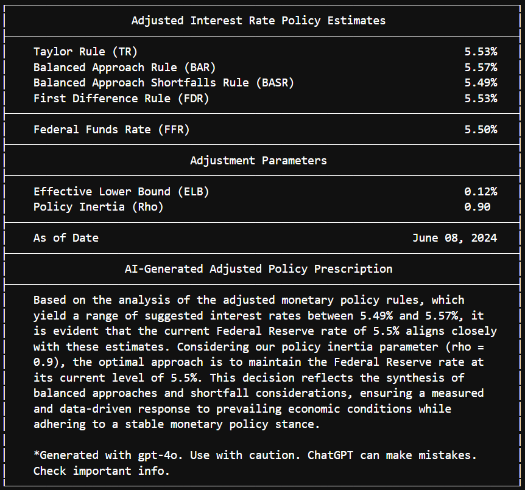

.. PyEconomics documentation master file, created by
   sphinx-quickstart on Sun May 23 2024.

Welcome to PyEconomics's documentation!
========================================

.. image:: _static/logo.png
   :alt: PyEconomics Logo

**PyEconomics** is a Python library for economic and financial analysis,
designed to provide tools and models for analyzing various aspects of economic,
financial, and fiscal policy. Whether you're a developer, economist, financial
analyst, or researcher, PyEconomics aims to be your go-to resource for
sophisticated economic modeling and analysis.

.. list-table::
   :header-rows: 1

   * - Category
     - Badge
   * - **Testing**
     - .. raw:: html

           
           
   * - **Package**
     - .. raw:: html

           
           
           
           
   * - **Documentation**
     - .. raw:: html

           
   * - **Release**
     - .. raw:: html

           
   * - **Build Status**
     - .. raw:: html

           
   * - **Maintainability**
     - .. raw:: html

           
   * - **Code Style**
     - .. raw:: html

           
   * - **Dependencies**
     - .. raw:: html

           
   * - **Security**
     - .. raw:: html

           

Contents
========

.. toctree::
   :maxdepth: 2
   :caption: Contents:

   introduction
   features
   installation
   api_key
   usage
   docker
   roadmap
   contributing
   contact

Introduction
============

**PyEconomics** is a versatile and comprehensive library that integrates
artificial intelligence with various economic and financial models. It is
designed to support the development and analysis of monetary policy rules,
exchange rate models, macroeconomic and microeconomic models, discounted cash
flow models, and much more.

Features
========

Current Features
----------------

- **AI Integration**: AI-generated monetary policy decisions.
- **Cache Management**: Efficient caching for API calls to improve performance
  and reduce redundant data fetching.
- **Monetary Policy Rules**: Implementation of well-known monetary policy rules.

Planned Features
----------------

- **Exchange Rate Models**: Models for predicting future exchange rates.
- **Macroeconomic Models**: Comprehensive macroeconomic models.
- **Microeconomic Models**: Detailed microeconomic models.
- **Discounted Cash Flow Models**: Advanced models for discounted cash flow
  analysis.
- **Financial Models**: Including CAPM and portfolio optimization.
- **Fiscal Policy Models**: Tools to analyze taxation, government spending, and
  public debt.
- **Additional Economic Models**: Support for behavioral economics, agent-based
  models, and international trade models.

Installation
============

To install PyEconomics, use ``pip``:

.. code-block:: sh

   pip install pyeconomics

From Source
-----------

If you want to install the package from the source code, follow these steps:

1. Clone the repository:

    .. code-block:: sh

       git clone https://github.com/nathanramoscfa/pyeconomics.git

2. Change to the project directory:

    .. code-block:: sh

       cd pyeconomics

3. Install the package:

    .. code-block:: sh

       pip install .

API Key
=======

Some features of PyEconomics require access to the FRED API. To use these
features, you need to configure your FRED API access.

A detailed step-by-step guide on obtaining and securely storing your FRED API
key is available here:

- `FRED API Key Configuration Guide (Markdown) <markdown/FRED_API_CONFIGURATION.md>`_
- `FRED API Key Configuration Guide (Jupyter Notebook) <examples/api_configuration/fred_api_configuration.ipynb>`_

- 'OpenAI API Key Configuration Guide (Markdown) <markdown/OPENAI_API_CONFIGURATION.md>`_
- 'OpenAI API Key Configuration Guide (Jupyter Notebook) <examples/api_configuration/openai_api_configuration.ipynb>`_

Usage
=====

Here are some basic examples of how to use PyEconomics for calculating and
visualizing monetary policy rules.

Example 1: Calculate Policy Rule Estimates Adjusted for Effective Lower Bound
(ELB) and Policy Inertia (Rho) with AI Analysis
-----------------------------------------------------------------------------
-----------------------------------------------

.. code-block:: python

    # Import pyeconomics
    import pyeconomics as pyecon

    # Define the economic indicators
    indicators = pyecon.EconomicIndicators()

    # Define the Monetary Policy Rule parameters
    params = pyecon.MonetaryPolicyRulesParameters(
        inflation_target=2.0,  # Fed Inflation Target
        rho=0.9,  # Policy Inertia Coefficient
        apply_elb=True,  # Apply Effective Lower Bound
        verbose=True,  # Print verbose statement
        include_ai_analysis=True  # Generate AI analysis
    )

    # Calculate policy rule estimates
    policy_estimates = pyecon.calculate_policy_rule_estimates(indicators, params)

Verbose Print Statement:

Example 2: Calculate and Plot Historical Adjusted Policy Rule Estimates
-----------------------------------------------------------------------

.. code-block:: python

    # Import pyeconomics modules
    import pyeconomics as pyecon

    # Define the economic indicators
    indicators = pyecon.EconomicIndicators()

    # Define the Monetary Policy Rule parameters
    params = pyecon.MonetaryPolicyRulesParameters(
        inflation_target=2.0,  # Fed Inflation Target
        rho=0.9,  # Policy Inertia Coefficient
        apply_elb=True,  # Apply Effective Lower Bound
        verbose=True,  # Print verbose statement
        include_ai_analysis=True  # Generate AI analysis
    )

    # Calculate historical policy rates
    historical_policy_estimates = pyecon.calculate_historical_policy_rates(
        indicators, params).dropna()

    # Plot historical policy rates
    pyecon.plot_historical_rule_estimates(historical_policy_estimates, params)

Verbose Print Statement:

.. image:: ../media/plot_historical_policy_rates.png

Example 3: Calculate Adjusted Taylor Rule for Effective Lower Bound (ELB) and
Policy Inertia (Rho)
-----------------------------------------------------------------------------
--------------------

.. code-block:: python

    # Import pyeconomics
    import pyeconomics as pyecon

    # Define the economic indicators
    indicators = pyecon.EconomicIndicators()

    # Define the Monetary Policy Rule parameters
    params = pyecon.TaylorRuleParameters(
        inflation_target=2.0,  # Fed Inflation Target
        rho=0.9,  # Policy Inertia Coefficient
        apply_elb=True,  # Apply Effective Lower Bound
        verbose=True,  # Print verbose statement
        include_ai_analysis=True  # Generate AI analysis
    )

    # Calculate adjusted policy rule estimates
    adjusted_policy_estimates = pyecon.taylor_rule(indicators, params)

Verbose Print Statement:

.. code-block:: none

    ==== Economic Indicators =================================================
      Current Inflation:                             2.94%
      Target Inflation:                              2.00%
      Current Unemployment Rate:                     4.00%
      Natural Unemployment Rate:                     4.41%
      Long-Term Real Interest Rate:                  2.00%
      Current Fed Rate:                              5.50%
      As of Date:                                    June 08, 2024

    ==== Gaps ================================================================
      Inflation Gap:                                 0.94%
      Unemployment Gap:                              0.41%

    ==== Taylor Rule =========================================================
      Long-Term Real Interest Rate:                  2.00%
      Current Inflation:                             + 2.94%
      Alpha * Inflation Gap:                         + 0.50 * 0.94%
      Beta * Okun Factor * Unemployment Gap:         + 0.50 * 2.00 * 0.41%
    --------------------------------------------------------------------------
      Unadjusted Taylor Rule Estimate:               5.82%

    ==== Adjusted Taylor Rule ================================================
      Effective Lower Bound (ELB) Adjustment:
      Maximum of Taylor Rule or ELB:                 max(5.82%, 0.12%)
    --------------------------------------------------------------------------
      Taylor Rule Adjusted for ELB:                  5.82%

      Policy Inertia Adjustment:
      Policy Inertia Coefficient (rho):              0.90
      Current Fed Rate:                              * 5.50%
      Adjustment Coefficient (1 - rho):              + (1 - 0.90)
      Taylor Rule Adjusted for ELB:                  * 5.82%
    --------------------------------------------------------------------------
      Adjusted Taylor Rule Estimate:                 5.53%

    ==== AI-Generated Policy Prescription ====================================
      Based on the Taylor Rule calculation and current macroeconomic
      conditions, the Committee recognizes that the unadjusted estimate
      stands at 5.82%, with inertia-adjusted rates at 5.53%. Given the
      current Federal Funds Rate of 5.5%, slight deviation from the inertia-
      adjusted rate suggests a measured approach. Inflation exceeds target
      by 0.94%, while the unemployment rate is below the natural rate by
      0.41%, indicating an overheating economy. Hence, the FOMC recommends
      maintaining the Federal Funds Rate near the current level, allowing
      for a slight upward adjustment to counter inflation while monitoring
      labor market conditions closely.

      *Generated with gpt-4o. Use with caution. ChatGPT can make mistakes.
      Check important info.
    ==========================================================================

.. image:: ../media/plot_adj_historical_rates.png

Examples
========

For more comprehensive examples, refer to the `examples <examples>`_ directory
in the repository.

Docker
======

To run **PyEconomics** in a Docker container, follow these steps:

1. **Ensure Docker is Running**: Make sure Docker is
[installed](https://www.docker.com/products/docker-desktop/) and running on
your system.

2. **Configure the .env File**: Create a ``.env`` file in the root directory of
the ``pyeconomics`` with the following content:

    .. code-block:: none

        FRED_API_KEY=YOUR_FRED_API_KEY
        OPENAI_API_KEY=YOUR_OPENAI_API_KEY

3. **Build the Docker Image**: Navigate to the root directory and run the
following command to build the Docker image:

    .. code-block:: sh

        docker build -t pyeconomics .

4. **Run the Docker Container**: Run the following command to start the Docker
container:

    .. code-block:: sh

        docker run --env-file .env -p 8080:8080 -it --rm pyeconomics

5. **Access the Jupyter Notebook**: In the command prompt output, you will see
something like this in the console output:

    .. code-block:: none

        To access the server, open this file in a browser:
            file:///root/.local/share/jupyter/runtime/jpserver-1-open.html
        Or copy and paste one of these URLs:
            http://d55fp8m9qat5:8080/lab/tree/monetary_policy_rules/monetary_policy_rules.ipynb?token=your_token_here
            http://127.0.0.1:8080/lab/tree/monetary_policy_rules/monetary_policy_rules.ipynb?token=your_token_here

To access JupyterLab, hold down the `Ctrl` key and click on the link starting
with: `http://127.0.0.1"8080`. Ignore the other links.

By using Docker, you can run PyEconomics in a containerized environment without
installing any dependencies on your local machine.

Roadmap
=======

The following models and categories are planned for future development.
`Contributions <contributing>`_ are welcome!

.. rubric:: Monetary Policy Models

- Taylor Rule
- Balanced Approach Rule
- First Difference Rule
- McCallum Rule
- Orphanides Rule
- Friedman Rule
- Interest Rate Smoothing Models

.. rubric:: Quantity of Money Theory

- Fisher Equation
- Cambridge Equation
- Velocity of Money Models
- Quantity Theory of Money (QTM)
- Money Demand Function (Md)

.. rubric:: Economic Models to Predict Future Exchange Rates

- Purchasing Power Parity (PPP)
- Interest Rate Parity (IRP)
- Monetary Models of Exchange Rates
- Portfolio Balance Models
- Behavioral Equilibrium Exchange Rate (BEER)
- Fundamental Equilibrium Exchange Rate (FEER)

.. rubric:: Macroeconomic Models

- IS-LM Model
- AD-AS Model
- Solow Growth Model
- New Keynesian Models
- RBC (Real Business Cycle) Model
- DSGE (Dynamic Stochastic General Equilibrium) Models

.. rubric:: Microeconomic Models

- Supply and Demand Models
- Consumer Choice Theory
- Production Theory
- Cost Functions
- Game Theory Models
- Market Structure Models (Perfect Competition, Monopoly, Oligopoly)

.. rubric:: Discounted Cash Flow Models

- Dividend Discount Model (DDM)
- Free Cash Flow to Equity (FCFE)
- Free Cash Flow to Firm (FCFF)
- Net Present Value (NPV)
- Internal Rate of Return (IRR)
- Adjusted Present Value (APV)

.. rubric:: Financial Models

- Capital Asset Pricing Model (CAPM)
- Arbitrage Pricing Theory (APT)
- Black-Scholes Option Pricing Model
- Bond Valuation Models
- Credit Risk Models (e.g., Merton Model)
- Portfolio Optimization Models (e.g., Markowitz Model)

.. rubric:: Fiscal Policy Models

- Taxation and Government Spending Models
- Budget Deficit Models
- Public Debt Models
- Fiscal Multiplier Models
- Laffer Curve
- Ricardian Equivalence

.. rubric:: Other Well-Known Economic Models

- Behavioral Economics Models
- Agent-Based Models
- Environmental Economics Models
- International Trade Models (e.g., Heckscher-Ohlin Model)
- Labor Market Models
- Health Economics Models

Contributing
============

Contributions are welcome! If you have a model you'd like to implement or an
improvement to an existing model, please refer to our detailed
`Contributing Guide <markdown/CONTRIBUTING.md>`_.

By participating in this project, you agree to abide by the
`Code of Conduct <markdown/CODE_OF_CONDUCT.md>`_.

Thank you for your contributions!

Contact
=======

If you have any questions, suggestions, or need support, feel free to reach out.

Nathan Ramos, CFA
-----------------

Welcome to my GitHub! I'm Nathan, an independent Fintech Developer with a
Chartered Financial Analyst (CFA) designation, specializing in Python-based
financial analysis, quantitative strategies, and automated trading programs.
Currently, I'm a fintech consultant open to new clients. Schedule a meeting
with me to discuss collaborating on your next project or to learn more about
my services.

📅 `Schedule a Meeting with Me <https://calendly.com/nrcapitalmanagement/github-meeting>`_

Connect with Me
---------------

- **Email**: `nathan.ramos.github@gmail.com <mailto:nathan.ramos.github@gmail.com>`_
- **Twitter**: `@nathanramoscfa <https://twitter.com/nathanramoscfa>`_

Feel free to connect with me for any inquiries or collaboration opportunities.

Indices and tables
==================

* :ref:`genindex`
* :ref:`modindex`
* :ref:`search`
