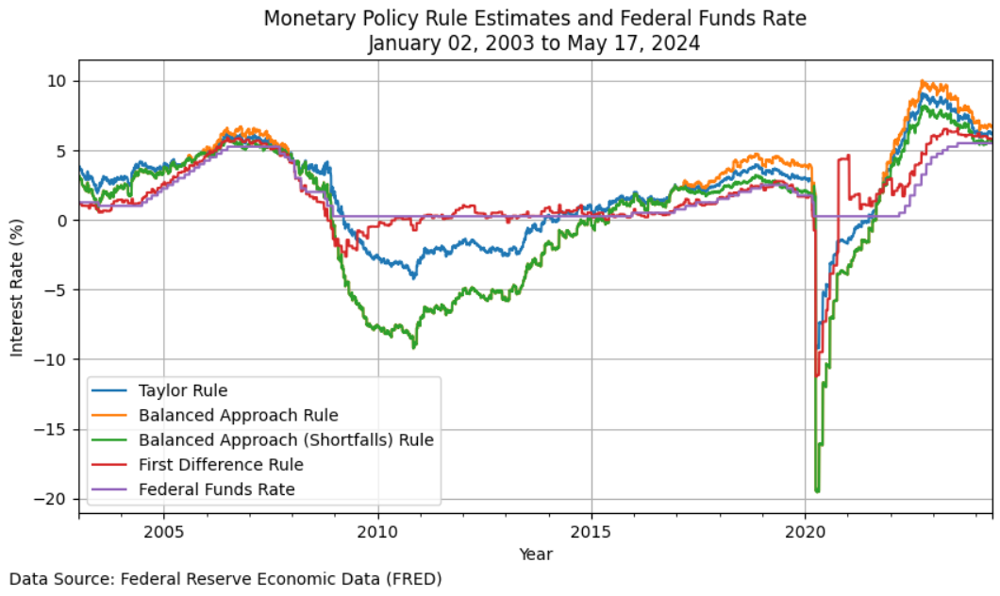
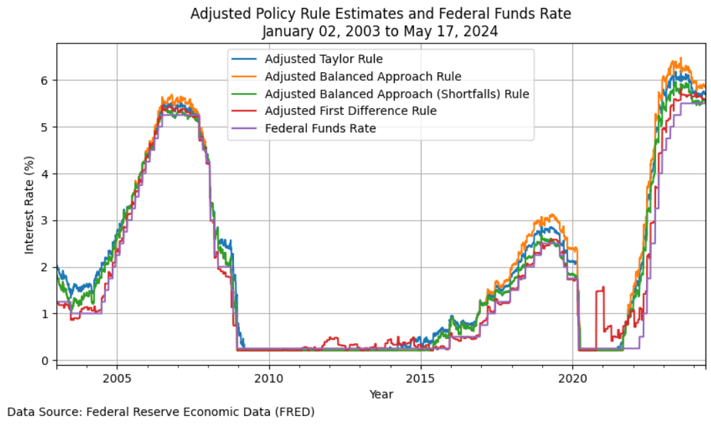

Usage
=====

Here are some basic examples of how to use PyEconomics for calculating and visualizing monetary policy rules.

Example 1: Calculate Current Policy Rule Estimates
--------------------------------------------------

.. code-block:: python

   # Import pyeconomics modules
   from pyeconomics.models.monetary_policy import calculate_policy_rule_estimates

   # Calculate policy rule estimates
   policy_estimates = calculate_policy_rule_estimates(verbose=True)

Verbose Print Statement:

.. code-block:: none

   ┌───────────────────────────────────────────────────────────────────────────────────┐
   │                           Interest Rate Policy Estimates                          │
   ├───────────────────────────────────────────────────────────────────────────────────┤
   │ Taylor Rule (TR)                                                      6.17%       │
   │ Balanced Approach Rule (BAR)                                          6.68%       │
   │ Balanced Approach Shortfalls Rule (BASR)                              5.66%       │
   │ First Difference Rule (FDR)                                           5.97%       │
   ├───────────────────────────────────────────────────────────────────────────────────┤
   │ Federal Funds Rate (FFR)                                              5.50%       │
   ├───────────────────────────────────────────────────────────────────────────────────┤
   │ As of Date                                                     May 20, 2024       │
   ├───────────────────────────────────────────────────────────────────────────────────┤
   │                                Policy Prescription                                │
   ├───────────────────────────────────────────────────────────────────────────────────┤
   │ Taylor Rule (TR) suggests raising the rate by 0.75%.                              │
   │ Balanced Approach Rule (BAR) suggests raising the rate by 1.25%.                  │
   │ Balanced Approach Shortfalls Rule (BASR) suggests raising the rate by 0.25%.      │
   │ First Difference Rule (FDR) suggests raising the rate by 0.50%.                   │
   └───────────────────────────────────────────────────────────────────────────────────┘

Example 2: Adjust Taylor Rule for Effective Lower Bound (ELB) and Policy Inertia
--------------------------------------------------------------------------------

.. code-block:: python

   # Import pyeconomics modules
   from pyeconomics.models.monetary_policy import calculate_policy_rule_estimates

   # Adjustment Parameters
   rho = 0.7  # Policy Inertia Coefficient
   apply_elb = True  # Apply Effective Lower Bound

   adjusted_policy_estimates = calculate_policy_rule_estimates(
       rho=rho,
       apply_elb=apply_elb,
       verbose=True
   )

Verbose Print Statement:

.. code-block:: none

   ┌───────────────────────────────────────────────────────────────────────────────────┐
   │                      Adjusted Interest Rate Policy Estimates                      │
   ├───────────────────────────────────────────────────────────────────────────────────┤
   │ Taylor Rule (TR)                                                      5.70%       │
   │ Balanced Approach Rule (BAR)                                          5.86%       │
   │ Balanced Approach Shortfalls Rule (BASR)                              5.55%       │
   │ First Difference Rule (FDR)                                           5.64%       │
   ├───────────────────────────────────────────────────────────────────────────────────┤
   │ Federal Funds Rate (FFR)                                              5.50%       │
   ├───────────────────────────────────────────────────────────────────────────────────┤
   │ As of Date                                                     May 21, 2024       │
   ├───────────────────────────────────────────────────────────────────────────────────┤
   │                            Adjusted Policy Prescription                           │
   ├───────────────────────────────────────────────────────────────────────────────────┤
   │ Taylor Rule (TR) suggests raising the rate by 0.25%.                              │
   │ Balanced Approach Rule (BAR) suggests raising the rate by 0.25%.                  │
   │ Balanced Approach Shortfalls Rule (BASR) suggests maintaining the current rate.   │
   │ First Difference Rule (FDR) suggests raising the rate by 0.25%.                   │
   └───────────────────────────────────────────────────────────────────────────────────┘

Example 3: Calculate Current Taylor Rule Estimates
--------------------------------------------------

.. code-block:: python

   # Import pyeconomics modules
   from pyeconomics.models.monetary_policy import taylor_rule

   # Calculate policy rule estimates
   policy_estimates = taylor_rule(verbose=True)

Verbose Print Statement:

.. code-block:: none

   ==== Economic Indicators =================================================
   Current Inflation:                               3.04%
   Target Inflation:                                2.00%
   Current Unemployment Rate:                       3.90%
   Natural Unemployment Rate:                       4.41%
   Long-Term Real Interest Rate:                    2.10%
   Current Fed Rate:                                5.50%
   As of Date:                                      May 21, 2024

   ==== Gaps ================================================================
   Inflation Gap:                                   1.04%
   Unemployment Gap:                                0.51%

   ==== Taylor Rule =========================================================
     Long-Term Real Interest Rate:                  2.10%
     Current Inflation:                             + 3.04%
     Alpha * Inflation Gap:                         + 0.50 * 1.04%
     Beta * Okun Factor * Unemployment Gap:         + 0.50 * 2.00 * 0.51%
   --------------------------------------------------------------------------
     Unadjusted Taylor Rule Estimate:               6.17%

   ==== Adjusted Taylor Rule ================================================
     Effective Lower Bound (ELB) Adjustment:
     Maximum of Taylor Rule or ELB:                 max(6.17%, 0.12%)
   --------------------------------------------------------------------------
     Taylor Rule Adjusted for ELB:                  6.17%

     Policy Inertia Adjustment:
     Policy Inertia Coefficient (rho):              0.70
     Current Fed Rate:                              * 5.50%
     Adjustment Coefficient (1 - rho):              + (1 - 0.70)
     Taylor Rule Adjusted for ELB:                  * 6.17%
   --------------------------------------------------------------------------
     Adjusted Taylor Rule Estimate:                 5.70%

   ==== Policy Prescription =================================================
     The Adjusted Taylor Rule Estimate is 0.20% higher than the Current
     Fed Rate. The Fed should consider raising the interest rate by 0.25%.

Example 4: Calculate and Plot Historical Policy Rule Estimates
--------------------------------------------------------------

.. code-block:: python

   # Import pyeconomics modules
   from pyeconomics.models.monetary_policy import calculate_historical_policy_rates
   from pyeconomics.models.monetary_policy import plot_historical_policy_rates

   # Calculate historical policy rates
   historical_policy_estimates = calculate_historical_policy_rates().dropna()

   # Plot historical policy rates
   plot_historical_policy_rates(historical_policy_estimates)

Example 5: Calculate and Plot the Adjusted Historical Policy Rules
------------------------------------------------------------------

.. code-block:: python

   # Import pyeconomics modules
   from pyeconomics.models.monetary_policy import calculate_historical_policy_rates
   from pyeconomics.models.monetary_policy import plot_historical_policy_rates

   # Adjustment Parameters
   rho = 0.7  # Policy Inertia Coefficient
   apply_elb = True  # Apply Effective Lower Bound

   # Calculate adjusted historical policy rates
   adjusted_historical_policy_estimates = calculate_historical_policy_rates(
       rho=rho,
       apply_elb=apply_elb
   ).dropna()

   # Plot adjusted historical policy rates
   plot_historical_policy_rates(
       adjusted_historical_policy_estimates,
       adjusted=True
   )

